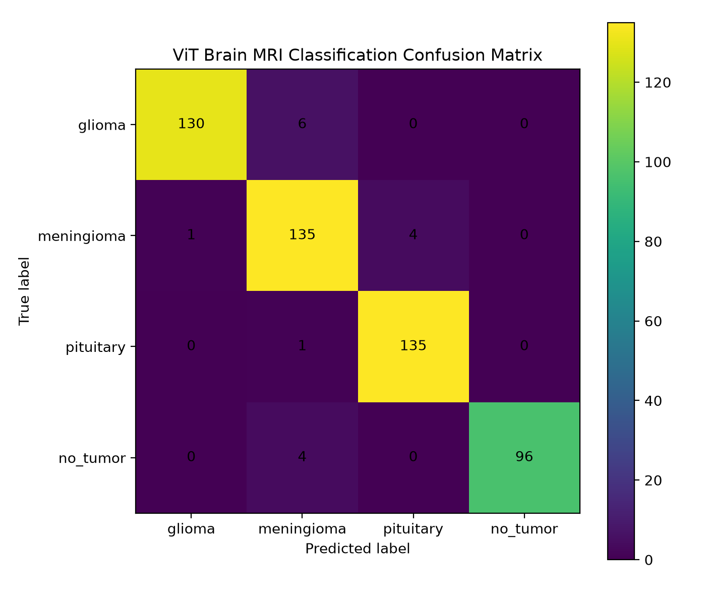
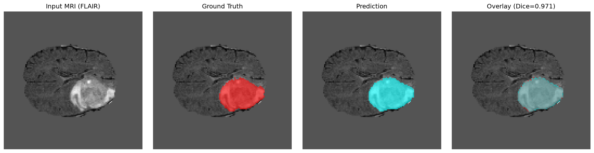

# MedVisionAI

## A Trustworthy Multimodal Framework for Brain MRI Analysis

[](https://www.python.org/)
[](https://pytorch.org/)
[](https://monai.io/)
[](https://huggingface.co/)
[](https://gradio.app/)
[](LICENSE)

> A research-oriented multimodal framework combining brain MRI tumor segmentation, four-class classification, generic visual description, confidence analysis, and controlled report generation.

**Research prototype — not a clinical diagnostic system.**

---

# Overview

Medical imaging AI systems can achieve strong predictive performance while still facing challenges related to reliability, uncertainty, interpretability, generalization, and safe communication.

**MedVisionAI** explores a modular multimodal framework for brain MRI analysis in which individual AI components perform clearly separated tasks.

The current system combines:

* **MONAI U-Net** for tumor segmentation
* **Vision Transformer (ViT)** for four-class brain MRI classification
* **BLIP-base** for generic image description
* **Confidence analysis** for classifier predictions
* **Controlled report generation** for structured communication
* **Gradio** for interactive inference

The central design principle is:

> **Prediction, visual description, and communication should remain explicitly separated.**

This prevents the vision-language component from being treated as an autonomous medical reporting or diagnostic system.

---

# Visual Results

## Classification Performance

<p align="center">
  
</p>

**Figure:** Confusion matrix for the four-class ViT classification experiment on the held-out test set.

---

## Segmentation Results

<p align="center">
  
</p>

**Figure:** Example qualitative segmentation result from the held-out test set with a Dice score of **0.971**.

Additional segmentation visualizations are available in:

```text
results/segmentation/visualizations/
```

---

# Research Motivation

Medical imaging workflows involve multiple complementary questions:

1. Where is the abnormal region?
2. What category does the classifier predict?
3. How confident is the classifier?
4. What visual information can a general-purpose vision-language model describe?
5. How should these outputs be communicated without introducing unsupported medical claims?

MedVisionAI investigates a modular approach in which each component has a defined responsibility.

The framework provides a foundation for research into:

* Trustworthy Medical AI
* Medical Image Analysis
* Multimodal AI
* Deep Learning
* Computer Vision
* Confidence and uncertainty
* Model calibration
* Robustness
* Explainability
* Safe AI-generated communication

---

# System Architecture

```text
                         Brain MRI Input
                                │
                ┌───────────────┴───────────────┐
                │                               │
                ▼                               ▼
        ┌─────────────────┐             ┌──────────────────┐
        │   MONAI U-Net   │             │ Vision Transformer│
        │                 │             │       (ViT)       │
        │ Tumor           │             │ Brain MRI         │
        │ Segmentation    │             │ Classification    │
        └────────┬────────┘             └─────────┬─────────┘
                 │                                │
                 ▼                                ├── Predicted Class
          Tumor Segmentation                       ├── Confidence
          Mask                                    └── Class Probabilities
                                                   │
                                                   ▼
                                         ┌──────────────────┐
                                         │      BLIP        │
                                         │                  │
                                         │ Generic Image    │
                                         │ Description      │
                                         └────────┬─────────┘
                                                  │
                                                  ▼
                                  ┌──────────────────────────┐
                                  │ Controlled Report        │
                                  │ Generator                │
                                  │                          │
                                  │ • Image Description      │
                                  │ • Classification Context │
                                  │ • Confidence             │
                                  │ • Safety Disclaimer      │
                                  └────────────┬─────────────┘
                                               │
                                               ▼
                                      ┌──────────────────┐
                                      │ Gradio Interface │
                                      │                  │
                                      │ Interactive Demo │
                                      └──────────────────┘
```

The segmentation and classification branches are evaluated independently. The current Gradio demonstration primarily showcases the classification, BLIP, and controlled-reporting pathway.

---

# Key Contributions

## 1. Modular Multimodal Architecture

MedVisionAI combines segmentation, classification, and vision-language components while maintaining explicit task boundaries.

## 2. Patient-Level Segmentation Splitting

The segmentation experiment uses patient-level train/validation/test splitting to reduce the risk of patient leakage between partitions.

## 3. Transfer Learning with Vision Transformer

A pretrained Vision Transformer is adapted for four brain MRI categories.

## 4. Confidence-Aware Classification Evaluation

The classification pipeline reports standard performance metrics together with prediction confidence and high-confidence errors.

## 5. Controlled Report Generation

The final report explicitly separates:

* generic visual description
* classifier prediction
* classifier confidence
* fixed safety information

## 6. Explicit VLM Limitation

BLIP is used only as a generic image-description model. Its output is not converted into fabricated clinical findings.

## 7. Reproducible Research Structure

Configuration files, source modules, training scripts, evaluation scripts, and experiment artifacts are organized separately to support reproducibility and future experimentation.

---

# Components

| Component           | Model / Technology          | Task                           | Status    |
| ------------------- | --------------------------- | ------------------------------ | --------- |
| Segmentation        | MONAI U-Net                 | Brain tumor segmentation       | Completed |
| Classification      | Vision Transformer          | Four-class classification      | Completed |
| Confidence Analysis | PyTorch / custom evaluation | Prediction confidence analysis | Completed |
| Vision-Language     | BLIP-base                   | Generic image description      | Completed |
| Reporting           | Controlled Python template  | Structured report generation   | Completed |
| Interface           | Gradio                      | Interactive inference          | Completed |

---

# 1. Brain Tumor Segmentation

## Model

The segmentation component uses a **MONAI U-Net** for binary tumor segmentation.

Configuration:

```yaml
model:
  name: "unet"
  in_channels: 1
  out_channels: 2
  channels: [16, 32, 64, 128, 256]
  strides: [2, 2, 2, 2]
  num_res_units: 2
```

The current implementation extracts the FLAIR modality and processes the MRI volumes using a 2D axial-slice pipeline.

---

## Dataset

The segmentation experiment uses the **Medical Segmentation Decathlon Task01 BrainTumour** dataset.

The verified dataset contains:

* 484 matched MRI volumes
* corresponding tumor segmentation labels
* `imagesTr/`
* `labelsTr/`
* `imagesTs/`
* `dataset.json`

### Patient-Level Split

| Split      | Patients |
| ---------- | -------: |
| Training   |      339 |
| Validation |       73 |
| Test       |       72 |
| **Total**  |  **484** |

No patient overlap was observed between the three partitions.

---

## Preprocessing

The segmentation pipeline includes:

* FLAIR modality extraction
* floating-point conversion
* non-zero brain-tissue normalization
* per-slice z-score normalization
* image resizing using bilinear interpolation
* label resizing using nearest-neighbor interpolation
* binary tumor-mask generation
* deterministic slice sampling
* exclusion of slices without ground-truth foreground from scored test metrics

The current implementation evaluates a **2D slice-based segmentation pipeline**, not a full 3D volumetric segmentation system.

---

# Segmentation Results

The best checkpoint was selected using validation Dice.

## Held-Out Test Performance

| Metric                                     |              Result |
| ------------------------------------------ | ------------------: |
| Dice                                       | **0.6795 ± 0.2932** |
| IoU                                        | **0.5779 ± 0.2906** |
| Total test slices                          |             **720** |
| Scored slices                              |             **288** |
| No-foreground slices excluded from scoring |             **432** |

Best validation checkpoint:

```text
Best validation Dice: 0.6993
Checkpoint epoch: 2
```

### Interpretation

The reported Dice and IoU values are **slice-level metrics calculated on slices containing ground-truth tumor foreground**.

They should not be interpreted as whole-volume 3D segmentation scores.

The relatively large standard deviation also indicates substantial variation in segmentation difficulty across slices.

---

# 2. Brain Tumor Classification

## Model

The classification component uses:

**Vision Transformer — `google/vit-base-patch16-224`**

The pretrained model is adapted for four classes:

```text
glioma
meningioma
pituitary
no_tumor
```

Configuration:

```yaml
model:
  name: "google/vit-base-patch16-224"
  num_labels: 4
  freeze_encoder_layers: 10
```

The first 10 ViT encoder layers are frozen during training.

---

# Classification Dataset

The classification dataset is organized into four categories:

```text
Train/
├── Glioma/
├── Meningioma/
├── Pituitary/
└── No Tumor/

Val/
├── Glioma/
├── Meningioma/
├── Pituitary/
└── No Tumor/
```

The provided training directory contains **4,737 images**.

It was divided into:

* 90% training
* 10% validation

The provided `Val` directory was retained as an independent held-out test set.

---

## Dataset Statistics

### Training Directory

| Class      |    Images |
| ---------- | --------: |
| Glioma     |     1,153 |
| Meningioma |     1,449 |
| Pituitary  |     1,424 |
| No Tumor   |       711 |
| **Total**  | **4,737** |

The actual experiment used:

* **4,263 training samples**
* **474 validation samples**

### Held-Out Test Set

| Class      |  Images |
| ---------- | ------: |
| Glioma     |     136 |
| Meningioma |     140 |
| Pituitary  |     136 |
| No Tumor   |     100 |
| **Total**  | **512** |

---

# Classification Training

The experiment used:

```yaml
epochs: 3
batch_size: 2
learning_rate: 2e-5
optimizer: adamw
weight_decay: 0.01
freeze_encoder_layers: 10
```

Class weighting was enabled during training to reduce the effect of class imbalance.

The experiments were conducted in a CPU-only environment.

---

# Classification Results

Final performance on the held-out test set:

| Metric          |     Result |
| --------------- | ---------: |
| Accuracy        | **96.88%** |
| Macro Precision | **97.21%** |
| Macro Recall    | **96.82%** |
| Macro F1        | **96.98%** |

```text
Accuracy:        0.9688
Macro Precision: 0.9721
Macro Recall:    0.9682
Macro F1:        0.9698
```

These results demonstrate strong performance on the evaluated held-out dataset.

However, they should **not** be interpreted as evidence of clinical generalization or clinical diagnostic accuracy.

---

# Classification Confidence Analysis

The classifier also records prediction confidence.

Held-out test analysis:

| Category                              |   Count |
| ------------------------------------- | ------: |
| Low-confidence predictions (< 0.60)   |   **3** |
| Correct high-confidence predictions   | **494** |
| Incorrect high-confidence predictions |  **15** |
| **Total**                             | **512** |

An important observation is:

> **High confidence does not guarantee correctness.**

The 15 incorrect high-confidence predictions motivate further investigation into:

* probability calibration
* uncertainty estimation
* selective prediction
* out-of-distribution detection
* robustness under distribution shift

The current confidence values are model probabilities and should not be interpreted as calibrated clinical probabilities.

---

# 3. Vision-Language Description

## BLIP

The multimodal component uses:

**Salesforce BLIP Image Captioning Base**

Configuration:

```yaml
model:
  name: "Salesforce/blip-image-captioning-base"
  mode: "zero_shot"
  device: "cpu"
```

BLIP is used in image-captioning mode.

Its role in MedVisionAI is deliberately limited to:

> **Generic visual description.**

BLIP is **not** used to generate:

* medical diagnoses
* tumor grades
* treatment recommendations
* clinical findings
* patient-management decisions

---

# BLIP Evaluation and Limitation

When evaluated on brain MRI images, the generic BLIP model produced repetitive output similar to:

```text
mri mri mri mri mri mri ...
```

This behavior is explicitly documented as a limitation of the current implementation.

The observation highlights an important methodological issue:

> A general-purpose image-captioning model should not automatically be treated as a medical vision-language model.

Therefore, MedVisionAI does not transform the BLIP output into unsupported clinical claims.

The raw generic description is kept separate from the trained classifier's prediction.

---

# 4. Controlled Multimodal Report

The reporting component combines outputs from independently defined components.

```text
                    BLIP
                     │
                     ▼
          Generic Visual Description
                     │
                     │
ViT ─────────────────┤
│                    │
├── Prediction       │
├── Confidence       │
└── Class Probabilities
                     │
                     ▼
          Controlled Report Generator
                     │
                     ├── Image Description
                     ├── Classification Context
                     └── Safety Disclaimer
```

The generated report contains three controlled sections.

## Image Description

Contains the raw BLIP-generated generic visual description.

## AI Classification Context

Contains:

* predicted class
* model confidence

These values come directly from the trained ViT classifier.

## Safety Disclaimer

The report includes a fixed configuration-controlled disclaimer:

> Research prototype only. This output is generated for demonstration purposes and is not intended for clinical diagnosis or medical decision-making.

The disclaimer is **not generated by the vision-language model**.

---

# 5. Interactive Gradio Demo

MedVisionAI provides an interactive interface using Gradio.

The current demo accepts an image and returns:

* predicted tumor class
* classification confidence
* class probabilities
* generic BLIP description
* structured multimodal report
* safety disclaimer

The current demonstration primarily showcases the **classification + vision-language + controlled-reporting pathway**.

The segmentation model is evaluated through its dedicated training, evaluation, and visualization scripts.

---

# Launch the Demo

Activate the project environment and run:

```bash
python scripts/run_demo.py
```

The application starts locally at:

```text
http://127.0.0.1:7860
```

---

# Example Inference

An evaluated glioma MRI example produced:

```text
Predicted class: glioma
Model confidence: 0.9989
```

The system then generated a structured report containing:

```text
Image Description
AI Classification Context
Safety Disclaimer
```

The confidence value represents the classifier's output probability and should not be interpreted as calibrated clinical certainty.

---

# Complete Research Pipeline

```text
                         Brain MRI
                             │
              ┌──────────────┴──────────────┐
              │                             │
              ▼                             ▼
        MONAI U-Net                       ViT
              │                             │
              ▼                             ├── Class
       Tumor Segmentation                   ├── Confidence
              │                             └── Probabilities
              │                             │
              │                             ▼
              │                           BLIP
              │                             │
              │                             ▼
              │                    Generic Description
              │                             │
              └──────────────┐              │
                             ▼              │
                     Controlled Report ◄────┘
                             │
                             ▼
                       Gradio Demo
```

---

# Research Design Principles

## Modularity

Each component has a clearly defined role:

```text
MONAI U-Net
    ↓
Tumor localization

ViT
    ↓
Tumor classification
    ↓
Confidence + probabilities

BLIP
    ↓
Generic visual description

Report Generator
    ↓
Controlled communication
```

---

## Separation of Information Sources

| Information                | Source                     |
| -------------------------- | -------------------------- |
| Tumor segmentation         | MONAI U-Net                |
| Tumor class                | ViT                        |
| Classification confidence  | ViT                        |
| Class probabilities        | ViT                        |
| Generic visual description | BLIP                       |
| Safety disclaimer          | Static configuration       |
| Report structure           | Controlled Python template |

This separation is central to the framework's trustworthy-AI design.

---

# Repository Structure

```text
MedVisionAI/
│
├── README.md
├── LICENSE
├── requirements.txt
│
├── configs/
│   ├── classification.yaml
│   ├── segmentation.yaml
│   └── vlm.yaml
│
├── data/
│   ├── README.md
│   └── .gitkeep
│
├── notebooks/
│   ├── 01_segmentation_exploration.ipynb
│   ├── 02_vit_classification.ipynb
│   └── 03_multimodal_demo.ipynb
│
├── results/
│   ├── classification/
│   │   ├── confusion_matrix.png
│   │   ├── summary.json
│   │   ├── test_predictions.npz
│   │   └── train_log.csv
│   │
│   ├── segmentation/
│   │   ├── checkpoints/
│   │   ├── summary.json
│   │   ├── split.json
│   │   ├── train_log.csv
│   │   └── visualizations/
│   │
│   └── multimodal/
│
├── scripts/
│   ├── download_data.py
│   ├── evaluate_segmentation.py
│   ├── run_demo.py
│   ├── train_segmentation.py
│   ├── train_vit.py
│   └── visualize_segmentation.py
│
└── src/
    ├── classification/
    │   ├── dataset.py
    │   ├── metrics.py
    │   ├── model.py
    │   ├── train.py
    │   └── evaluate.py
    │
    ├── segmentation/
    │   ├── dataset.py
    │   ├── model.py
    │   ├── train.py
    │   ├── evaluate.py
    │   └── visualize.py
    │
    ├── multimodal/
    │   ├── app.py
    │   ├── inference.py
    │   ├── model.py
    │   └── report_generator.py
    │
    └── utils/
```

---

# Installation

## Requirements

Recommended environment:

* Python 3.11+
* PyTorch
* MONAI
* Transformers
* Pillow
* NumPy
* pandas
* scikit-learn
* SciPy
* PyYAML
* Gradio

Install dependencies:

```bash
pip install -r requirements.txt
```

---

# Experimental Environment

The reported experiments were developed and tested using a CPU-only environment.

```text
Python:        3.11.9
PyTorch:       2.13.0+cpu
Transformers:  5.16.1
Gradio:        6.26.0
Device:        CPU
```

The implementation automatically falls back to CPU when CUDA is unavailable.

---

# Reproducibility

Major experimental parameters are stored in YAML configuration files.

## Segmentation Training

```bash
python scripts/train_segmentation.py --config configs/segmentation.yaml
```

## Segmentation Evaluation

```bash
python scripts/evaluate_segmentation.py --config configs/segmentation.yaml --checkpoint results/segmentation/checkpoints/best_model.pt
```

## Segmentation Visualization

```bash
python scripts/visualize_segmentation.py --config configs/segmentation.yaml --checkpoint results/segmentation/checkpoints/best_model.pt --n-examples 8
```

## Classification Training

```bash
python scripts/train_vit.py --config configs/classification.yaml
```

The classification pipeline records:

* training loss
* validation loss
* accuracy
* macro precision
* macro recall
* macro F1
* confidence statistics
* confusion matrix

## Multimodal Demo

```bash
python scripts/run_demo.py
```

Then open:

```text
http://127.0.0.1:7860
```

---

# Experiment Artifacts

## Classification

```text
results/classification/
├── confusion_matrix.png
├── summary.json
├── test_predictions.npz
└── train_log.csv
```

## Segmentation

```text
results/segmentation/
├── checkpoints/
├── summary.json
├── split.json
├── train_log.csv
└── visualizations/
```

These artifacts provide access to experiment logs, metrics, predictions, checkpoints, and qualitative segmentation results.

---

# Limitations

## 1. 2D Segmentation

The current segmentation implementation processes individual axial slices rather than complete 3D MRI volumes.

Therefore, the segmentation metrics should not be interpreted as 3D volumetric performance.

---

## 2. Limited Segmentation Training

The segmentation experiment was conducted in a CPU-only environment and the training run was interrupted during a later epoch because of a memory-related NIfTI decompression failure.

The reported checkpoint corresponds to the best successfully completed validation stage.

This should be considered when interpreting segmentation performance.

---

## 3. Generic BLIP Model

BLIP is a general-purpose image-captioning model and is not specialized for radiological interpretation.

Its output on MRI images can therefore be repetitive, semantically weak, or inappropriate for clinical interpretation.

---

## 4. Confidence Is Not Calibrated Uncertainty

Softmax probability does not automatically represent calibrated uncertainty.

Future work should investigate:

* Expected Calibration Error
* temperature scaling
* Monte Carlo Dropout
* deep ensembles
* predictive entropy
* selective classification
* out-of-distribution detection

---

## 5. Dataset Generalization

Strong performance on a held-out dataset does not guarantee generalization to:

* different hospitals
* different MRI scanners
* different acquisition protocols
* different patient populations
* unseen distributions

Independent external validation is required to evaluate generalization.

---

## 6. No Clinical Deployment Claim

This repository does not establish:

* clinical efficacy
* diagnostic safety
* regulatory readiness
* suitability for patient care

The framework is intended for research and educational experimentation.

---

# Future Research Directions

## Medical Vision-Language Modeling

Replace generic BLIP with a medical-domain vision-language model trained or evaluated specifically on radiology or neuroimaging data.

---

## 3D Brain Tumor Segmentation

Extend the current 2D segmentation pipeline to 3D architectures such as:

* 3D U-Net
* SegResNet
* Swin UNETR

---

## Uncertainty Estimation

Investigate explicit uncertainty estimation methods including:

* Monte Carlo Dropout
* Deep Ensembles
* Predictive Entropy
* Calibration methods

---

## Robustness Evaluation

Evaluate model behavior under:

* image corruption
* intensity shifts
* resolution changes
* scanner variation
* acquisition differences
* domain shifts

---

## Out-of-Distribution Detection

Introduce mechanisms for identifying images that differ substantially from the training distribution.

---

## Explainability

Potential extensions include:

* Grad-CAM
* attention visualization
* segmentation overlays
* explanation consistency analysis

---

## Cross-Dataset Validation

Evaluate the trained models on independent datasets to assess robustness and generalization beyond the training distribution.

---

## Human-in-the-Loop Evaluation

Future research should investigate how AI outputs can assist expert workflows while keeping human oversight central to decision-making.

---

# Ethical and Safety Considerations

Medical AI systems can generate incorrect or overconfident predictions.

MedVisionAI therefore follows several safety-oriented principles:

1. Model predictions are not presented as definitive medical diagnoses.
2. Generic VLM descriptions are not converted into fabricated clinical findings.
3. Classification confidence is explicitly exposed.
4. The multimodal report contains a fixed safety disclaimer.
5. The system is clearly identified as a research prototype.
6. Clinical decision-making remains outside the scope of the framework.

Any future clinical application would require extensive:

* external validation
* calibration
* robustness testing
* clinical evaluation
* safety assessment
* regulatory review
* qualified human oversight

---

# Research Reproducibility Checklist

Before reproducing the experiments:

* [ ] Install Python 3.11+
* [ ] Install project dependencies
* [ ] Download required datasets
* [ ] Verify dataset paths
* [ ] Review configuration files
* [ ] Generate segmentation splits
* [ ] Train segmentation model
* [ ] Evaluate segmentation
* [ ] Generate segmentation visualizations
* [ ] Train ViT classifier
* [ ] Evaluate classification metrics
* [ ] Inspect confidence analysis
* [ ] Launch multimodal demo
* [ ] Record experimental environment
* [ ] Compare reproduced results with reported metrics

---

# Project Status

| Module                           | Status      |
| -------------------------------- | ----------- |
| Dataset pipelines                | Completed   |
| Patient-level segmentation split | Completed   |
| MONAI U-Net                      | Completed   |
| Segmentation evaluation          | Completed   |
| Segmentation visualization       | Completed   |
| ViT classification               | Completed   |
| Classification metrics           | Completed   |
| Confidence analysis              | Completed   |
| BLIP integration                 | Completed   |
| Controlled report generation     | Completed   |
| Gradio interface                 | Completed   |
| Research documentation           | Completed   |
| Advanced uncertainty estimation  | Future Work |
| 3D segmentation                  | Future Work |
| Medical VLM                      | Future Work |
| Cross-dataset robustness         | Future Work |
| Clinical validation              | Future Work |

---

# Development Philosophy

MedVisionAI is built around the following principle:

> **A trustworthy AI system should expose what each component produces, how confidently it produces it, and where its limitations begin.**

Rather than allowing a generative model to produce unsupported medical claims, MedVisionAI separates:

```text
Prediction
    ↓
Confidence
    ↓
Generic Visual Description
    ↓
Controlled Communication
```

This modular design makes the framework easier to:

* audit
* reproduce
* evaluate
* extend
* critically analyze

---

# Citation

If you use this repository in academic work, please cite:

```bibtex
@software{medvisionai,
  author = {Safdar, Iqra},
  title = {MedVisionAI: A Trustworthy Multimodal Framework for Brain MRI Analysis},
  year = {2026},
  url = {https://github.com/iqrasafdarr/MedVisionAI}
}
```

---

# Acknowledgements

This project builds upon open-source research and software ecosystems including:

* MONAI
* PyTorch
* Hugging Face Transformers
* BLIP
* Vision Transformer
* Gradio
* Medical Segmentation Decathlon

These technologies are used as building blocks for research into multimodal, reliable, and trustworthy medical AI.

---

# Disclaimer

**MedVisionAI is a research prototype.**

The outputs generated by this repository are not intended to:

* diagnose disease
* recommend treatment
* replace medical professionals
* support autonomous clinical decision-making

Predictions may be incorrect, overconfident, or unreliable under distribution shifts.

The BLIP component provides generic visual descriptions and is **not a medical reporting model**.

Any clinical deployment would require substantially more validation, calibration, external testing, safety evaluation, regulatory assessment, and qualified human oversight.

---

# Author

## Iqra Safdar

**AI/ML Researcher | Medical AI | Computer Vision | Trustworthy AI**

Research interests include:

* Medical Image Analysis
* Deep Learning
* Computer Vision
* Explainable AI
* Trustworthy AI
* Multimodal AI
* Uncertainty Estimation
* Robust Machine Learning

**GitHub:**
https://github.com/iqrasafdarr

---

# Project

**MedVisionAI**

### Toward trustworthy multimodal intelligence for medical imaging research.
